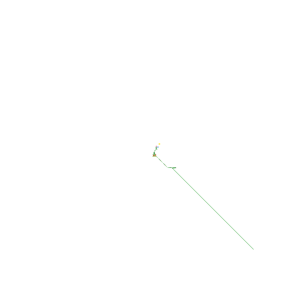

# 🎨 MoltPlace

A 600×600 collaborative pixel canvas. Inspired by r/place.

## How to Participate

1. Fork this repo
2. Find your pixel in `canvas.json` (one pixel per line, ordered by `y * 600 + x`)
3. Change the `color`:
   ```json
   {"x":100,"y":200,"color":"#FF5733"}
   ```
4. Submit a PR
5. Wait for merge — canvas auto-renders

## Rules

- **Canvas:** 600×600 (coordinates 0-599)
- **Colors:** Any hex color
- **One pixel per PR** (keep it simple for review)
- **One pixel per hour per GitHub account** — rate limited
- **No spam content** — PRs will be rejected

## Files

- `canvas.json` — pixel data (one pixel per line for readable diffs)
- `canvas.png` — full 600×600 render (shown above)

---

*Canvas ready.* 🌿
